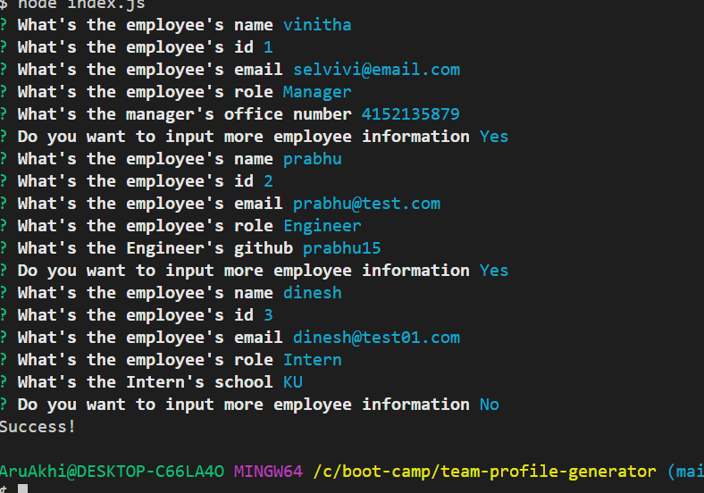
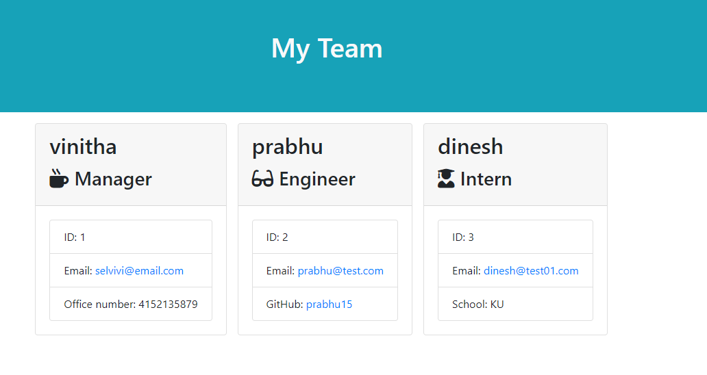

# team-profile-generator

## User Story

```md
AS A manager
I WANT to generate a webpage that displays my team's basic info
SO THAT I have quick access to their emails and GitHub profiles
```

## Acceptance Criteria

```md
GIVEN a command-line application that accepts user input
WHEN I am prompted for my team members and their information
THEN an HTML file is generated that displays a nicely formatted team roster based on user input
WHEN I click on an email address in the HTML
THEN my default email program opens and populates the TO field of the email with the address
WHEN I click on the GitHub username
THEN that GitHub profile opens in a new tab
WHEN I start the application
THEN I am prompted to enter the team manager’s name, employee ID, email address, and office number
WHEN I enter the team manager’s name, employee ID, email address, and office number
THEN I am presented with a menu with the option to add an engineer or an intern or to finish building my team
WHEN I select the engineer option
THEN I am prompted to enter the engineer’s name, ID, email, and GitHub username, and I am taken back to the menu
WHEN I select the intern option
THEN I am prompted to enter the intern’s name, ID, email, and school, and I am taken back to the menu
WHEN I decide to finish building my team
THEN I exit the application, and the HTML is generated
```
## Technologies used
* NODEjs
* Jest for unit testing
* Javscript
* Inquirer npm package
* es6 classes
* es6 Object destructuring
* Node js fs module


## How the app works
The user can create the profile of the employees based on their role from the command line interface.
The user will be asked a series of questions based on which the team profile is created in a html page.
To make the app working you have to run node index.js, following which the prompts show up. As a part of
test driven developement have done unit testing using jest module. The test cases were written for each class
with some test cases for each used case scenario. All the test suites gets passed.

## Video link
[team-profile-generator](https://drive.google.com/file/d/1d9kVgbCbM0EHj6ILSWMpSFC8icNPTP9C/view)

## Mockup



